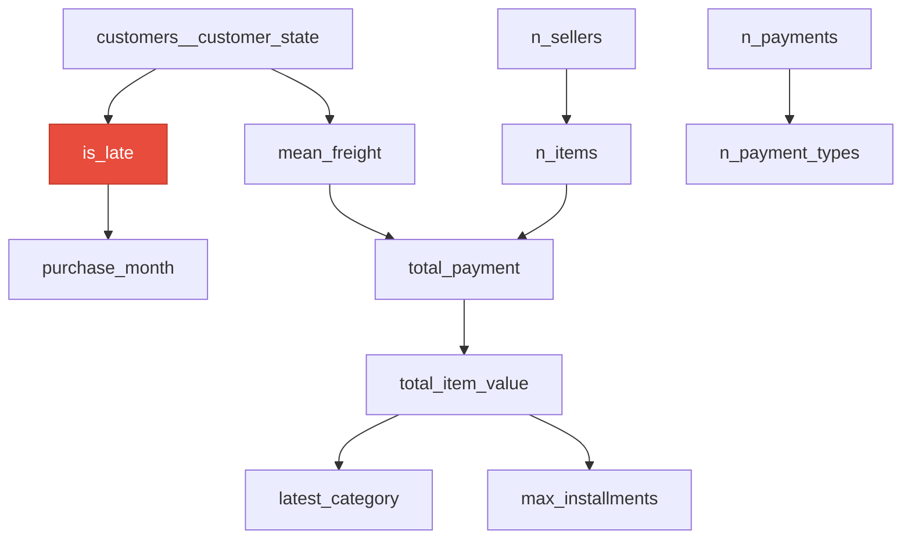

# Olist Late-Delivery Network

Predicting **`is_late`** (positive label: `1`).

## Network structure

Each arrow `A --> B` means *A directly influences B*. The highlighted node is the target.

## Relationships

- `customers__customer_state` directly predicts `is_late`
- `customers__customer_state` influences `mean_freight`
- `purchase_month` depends on the outcome `is_late`
- `mean_freight` influences `total_payment`
- `n_items` influences `total_payment`
- `n_payments` influences `n_payment_types`
- `n_sellers` influences `n_items`
- `total_item_value` influences `latest_category`
- `total_item_value` influences `max_installments`
- `total_payment` influences `total_item_value`
